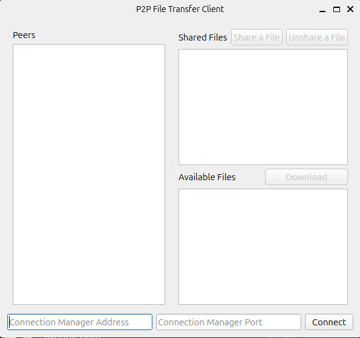
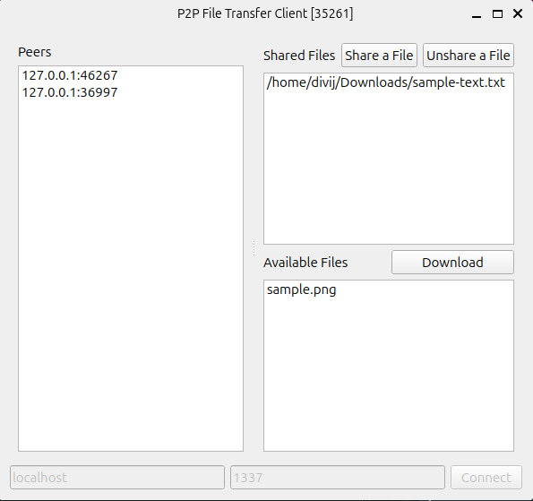

# P2P-File-Transfer

## Description and Working

This application leverages a peer-to-peer architecture to enable seamless file transfer between users on the network. By connecting directly with one another, peers can share and receive files without relying on a central server, fostering a decentralized and efficient data exchange environment. The application not only simplifies the process of sharing files but also enhances collaboration and resource sharing among users, making it an ideal solution to manage and distribute files effectively within a community or network.

Using peer-to-peer technology as opposed to the traditional client-server model, allows the entire network's load to be distributed among the peers on the network. Additionally, if the node that originally hosted the file is down, the file still potentially exists on the network if any other peer downloaded it.

The application allows users to share files among one another over a network. Once connected to the network, users may mark a file on their device to be shared. This will allow other nodes to see and download the file.

## Prerequisites

The application was written in C++. [Boost.Asio](http://www.boost.org/users/download/ "Boost.Asio") was used for sockets programming and [cmake](https://cmake.org/download/) was used to implement the GUI. Both are cross-platform and may be downloaded with little to no ease. 

1. **Boost Library**:

    The project relies on Boost.Asio for network programming.
   
    For Linux-based systems
   
        sudo apt-get install libboost-all-dev

   For macOS using Homebrew:
   
       brew install boost

   For Windows, you can download Boost from the official [Boost website](https://www.boost.org/) and follow the installation guide.

2. **CMake**:

    CMake is required to build the project.
  
    For Linux-based systems
   
        sudo apt-get install cmake

    For macOS using Homebrew:
   
        brew install cmake

    For Windows, you can download cmake from the official [cmake website](https://cmake.org/download/) and follow the installation guide.

3. **G++/Clang**:

    Ensure you have a C++ compiler such as g++ or clang.

## Usage

1. Run the connection manager executable (`./connectionmanager` on Linux).
2. Run the client(s).

 

## Key Features

1. **Connection Management**: Users connect to the network through the `P2PNode` class, which facilitates communication between peers.

2. **File Sharing**: Users can select and mark files for sharing. The application updates the peer list, allowing all connected nodes to see and access these files.

3. **Download Capability**: Other users can browse and download shared files directly from their peers through established socket connections, managed by the `handleConnection` method.

4. **User-Friendly Interface**: Built with cmake, the application offers an intuitive interface for viewing connected peers and available files, which updates dynamically.

5. **Multithreading for Performance**: The application utilizes multithreading to handle incoming connections without freezing the user interface, ensuring a smooth user experience.

## Further Improvements

1. **Efficiency**

The application allows file sharing without a central server but can lead to congestion when popular files are concentrated on a single node. To improve this, peers should share the same file, enabling downloads from multiple sources. Clients could also download file pieces from various peers and must share a piece to obtain another, similar to BitTorrent.

2. **Security**

Enhancing data integrity is crucial. Using checksums like MD5 could help, but a better approach is implementing Merkle trees. Clients can verify file pieces against a Merkle root from trusted sources. This method enhances security and integrity in file transfers.

